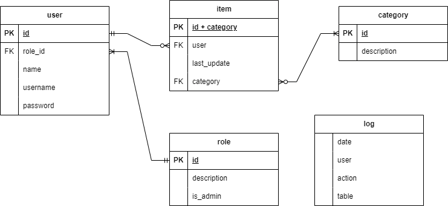

# Restful-CRUD-App
This is a Restful CRUD App Sample divided in Frontend, Backend and Database.

## Requirements
### Use Cases
**Actor(s):**
- Regular User
- Super User

1. **Preconditions:**
   - A user (regular/super) must exist in the database with mandatory fields such as username, full name, and password.

2. **Basic Flow:**
   - Super user logs into the app with secure authentication.
   - Super user creates a Regular user with unique credentials.
   - Super user logs out securely.
   - Regular user logs into the app using their credentials.
   - Regular user performs CRUD actions securely.
   - If a delete action is required, the Super user must securely log into the app to execute it.

3. **Alternate Flow(s):**
   - If a Regular user already exists during Super user creation, the system will display a user-friendly error message guiding the Super user to resolve the duplication issue.
   - Editing a Regular user requires Super user authentication to ensure the security of user data and roles.

4. **Security Considerations:**
- Authentication mechanisms are in place to safeguard user logins and actions.
- Authorization checks are implemented to ensure that only super users can execute critical actions.

### Business Rules
- Critical operations such as delete or user management only can be performed by admin users.
- User usernames must be unique.
- User must have identification, name, username and password.
- Users are created with Regular role as default.
## Suggested Software Architecture

## Data Schema

## Class Diagram

## Tech Stack
- Springboot
- Docker
- React.js
- Typescript
- MySQL